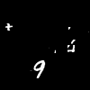
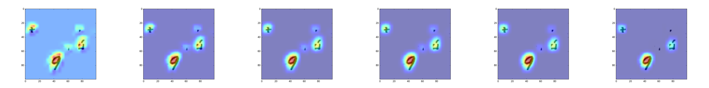

# Learning Deep Features for Discriminative Localization
**Tensorflow Implementation**

https://arxiv.org/abs/1512.04150

## Abstract

*In this work, we revisit the global average pooling layer and shed light on how it explicitly enables the convolutional neural network to have remarkable localization ability despite being trained on image-level labels. While this technique was previously proposed as a means for regularizing training, we find that it actually builds a generic localizable deep representation that can be applied to a variety of tasks. Despite the apparent simplicity of global average pooling, we are able to achieve 37.1% top-5 error for object localization on ILSVRC 2014, which is remarkably close to the 34.2% top-5 error achieved by a fully supervised CNN approach. We demonstrate that our network is able to localize the discriminative image regions on a variety of tasks despite not being trained for them.*

## Class Activation Mapping and Class-specific Saliency Map

*We propose a technique for generating class activation maps using the global average pooling (GAP) in CNNs. A class activation map for a particular category indicates the discriminative image regions used by the CNN to identify that category. The procedure for generating these maps is illustrated as follows:*

    

*Class activation maps could be used to intepret the prediction decision made by the CNN. The left image below shows the class activation map of top 5 predictions respectively, you can see that the CNN is triggered by different semantic regions of the image for different predictions. The right image below shows the CNN learns to localize the common visual patterns for the same object class.*

    

## Toy example on MNIST cluttered dataset

*LeNet* was used on the [MNIST cluttered dataset]((https://github.com/deepmind/mnist-cluttered)), provided by DeepMind.
We removed the last fully connected layers and replaced them with the **Class Activation Map**.
The accuracy was 97% after 50 epochs. Here is an example of an input image:

    

And the output of the **Class Activation Map**, at different steps:

    

